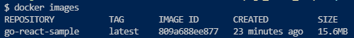

# Go-React-Sample

This repository provides a briefly sample application of using Go/Gin-Web-Framework as server side and TypeScript/React as client side.

## Docker multi-stage building

```
docker build -t go-react-sample .
docker run -p 8080:8080 -it go-react-sample
```

Multi-stage building can reduce the size of final Docker-Image.


## Routing

Note : Routing priotity is "Gin-Engine >> React-route" and "implementation by" does not mean "routing by"

- /

  - implementation by : React

  - display : the element "TopPage" (It's originally App element by "create-react-app")

- /hello

  - implementation by : React

  - display : the words "hello world"

- /world

  - implementation by : React

  - display : the element "World" (which does GET method for /api endpoint down below by using axios.get())

- /api

  - implementation by : Go

  - return : json object {"hello": "world"}

- /\* (no route)

  - status 404

# LICENSE

The source code is licensed MIT. 
see LICENSE.
